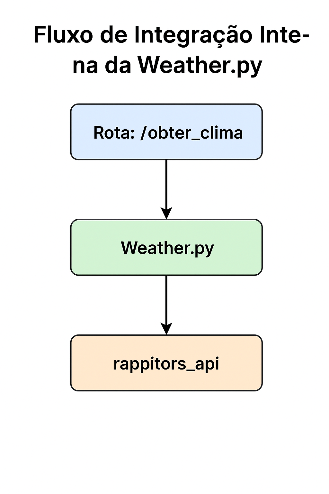

# Integracao do Sistema do Projeto

# 1. Mapeamento das Integrações do Projeto  

&emsp;&emsp;O nosso projeto tem como objetivo a **aferição de métricas** no contexto do software da Rappi, sendo elas voltadas a Tecnologia, Sistema e Operações. Através do monitoramento de diferentes indicadores, buscamos entender e otimizar o serviço voltado aos entregadores como a alocação de pedidos, reduzindo tempos de espera e melhorando a eficiência do serviço.  

&emsp;&emsp;Para garantir uma análise precisa, o sistema conta com **integrações externas e internas** que complementam os dados internos, permitindo cruzar informações como **condições climáticas** e **geolocalização** dos entregadores. Abaixo, apresentamos um mapeamento detalhado dessas integrações. 

## Integrações Utilizadas  

| **Integração**       | **Descrição** | **Objetivo** | **Exemplo de Uso** |  
|----------------------|--------------|-------------|----------------------|  
| **Weather.py (API Externa e Interna - rappitors_api)**  | Possui duas camadas de integração: **1) Externa**: Utiliza a biblioteca `httpx` para consumir um serviço externo de previsão do tempo (`wttr.in`). **2) Interna**: Os dados obtidos externamente são processados e disponibilizados por meio da API central do sistema (`rappitors_api`). | Avaliar se **condições climáticas adversas** impactam o tempo de espera e a eficiência das entregas. | Se a temperatura estiver elevada ou houver chuva intensa, pode ser observada uma **redução na velocidade média dos entregadores** ou **aumento no tempo de espera** devido a menor disponibilidade. |  
| **Geopy**           | Biblioteca utilizada para geocodificação e cálculo de distância entre coordenadas geográficas. Permite identificar a localização exata dos entregadores e calcular distâncias percorridas. | Determinar **a eficiência dos entregadores** ao correlacionar a distância percorrida com o tempo de espera. | Um entregador que percorre **grandes distâncias enquanto aguarda alocação** pode indicar **ineficiência no processo de distribuição de pedidos**. |  

# 2. Aplicação da Engenharia Simultânea no Planejamento  

&emsp;&emsp;A engenharia simultânea foi aplicada no planejamento do projeto com o objetivo de otimizar o desenvolvimento e evitar bloqueios entre os integrantes do grupo. 

&emsp;&emsp;A estratégia adotada foi **focar primeiro na API central (`rappitors_api`)**, garantindo uma base sólida para as demais integrações. Após essa etapa, cada membro da equipe trabalhou em um serviço específico de forma independente, garantindo que o progresso de um não impactasse o outro.  

&emsp;&emsp;Abaixo, detalhamos como essa abordagem foi aplicada em **passos estruturados**, destacando os serviços desenvolvidos e sua integração no dashboard final.  

## **Passo 1: Desenvolvimento da API Central (`rappitors_api`)**  

&emsp;&emsp;O primeiro foco do projeto foi a criação da **API central**, que serviria como ponto de comunicação entre todos os serviços. Esse núcleo foi essencial para estruturar **as regras de negócio, armazenamento de dados e endpoints de consulta**.  

**Ações:**  
- Definição do **banco de dados** e estrutura de tabelas.  
- Implementação dos **endpoints de consulta e atualização** de métricas.  
- Garantia de que todos os serviços pudessem **se conectar à API de maneira padronizada**.  

**Importância:** 

&emsp;&emsp;A API central estabeleceu um **ponto único de integração**, permitindo que os demais serviços fossem desenvolvidos de forma independente.  

## **Passo 2: Desenvolvimento Independente dos Serviços**  

&emsp;&emsp;Após a conclusão da **`rappitors_api`**, cada integrante do time assumiu a responsabilidade de um serviço específico. Essa divisão garantiu que **nenhum trabalho bloqueasse o outro**, permitindo um avanço paralelo eficiente.  

| Serviço | Responsável | Descrição |
|---------|------------|-----------|
| **Monitoramento dos serviços (healthcheck)** | Dev 1 | Implementação de endpoints para verificar a saúde dos serviços e garantir que todos estivessem ativos e respondendo corretamente. |
| **Alocação dos entregadores** | Dev 2 | Desenvolvimento do sistema de **gestão de alocação**, garantindo que entregadores fossem designados de forma eficiente aos pedidos. |
| **API de clima** | Dev 3 | Integração com uma API externa para obter informações meteorológicas, permitindo analisar o impacto das condições climáticas nas operações. |
| **Status do entregador** | Dev 4 | Implementação do serviço que monitora **localização, disponibilidade e estado** dos entregadores em tempo real. |
| **Status do Git e Versionamento** | Dev 5 | Configuração e manutenção do **versionamento do código**, garantindo organização e rastreamento das alterações no repositório de forma automatizada  (estrutura estática). |

**Importância:** 

&emsp;&emsp;Com cada desenvolvedor focado em um serviço isolado, evitamos dependências excessivas, reduzimos conflitos no código e aceleramos o desenvolvimento.  

## **Passo 3: Integração dos Serviços no Dashboard (Grafana)**  

&emsp;&emsp;Com os serviços concluídos e funcionando de forma independente, cada integrante passou a integrar os dados gerados **ao dashboard no Grafana**, que foi utilizado para **visualização e análise das métricas**.  

**Ações:**  
- Criação de **gráficos e painéis personalizados** para cada métrica coletada.  
- Configuração de **alertas automáticos** baseados nos dados processados.  
- Ajustes de **queries e filtragens** para otimizar a experiência dos usuários ao analisar os dados.  

**Importância:** 

&emsp;&emsp;O uso do **Grafana** possibilitou a **centralização e visualização eficiente dos dados**, facilitando a interpretação das métricas operacionais e logísticas, tecnológicas e dos serviços.  

# 3. Reflexão sobre a Divisão dos Pontos no Projeto

&emsp;&emsp;A divisão dos pontos no projeto foi estruturada para minimizar dependências entre os integrantes e permitir que cada um trabalhasse de forma independente. No entanto, um dos principais desafios encontrados foi o trabalho simultâneo no Grafana.

&emsp;&emsp;Diferente dos demais serviços, onde cada integrante pôde focar em uma API ou funcionalidade específica, o dashboard do Grafana apresentava um obstáculo: não havia uma maneira eficiente para todos trabalharem simultaneamente na configuração dos painéis. Embora fosse possível exportar e compartilhar os painéis via JSON, esse processo demandava tempo extra para versionamento e controle manual das alterações.

&emsp;&emsp;Dado o curto prazo do projeto, optamos por uma abordagem funcional em vez de uma mais arquiteturalmente correta. Isso significou que, em vez de implementarmos um fluxo colaborativo mais estruturado para o Grafana, o trabalho nele foi sequencial, com um integrante ajustando os painéis e os demais revisando posteriormente.

## 3.1 Como Poderia Ter Sido Melhor

### Uso de um Repositório Centralizado para Dashboards
&emsp;&emsp;Poderíamos ter criado um repositório dedicado apenas para os arquivos JSON dos dashboards, utilizando controle de versão (Git) para gerenciar as mudanças. Isso permitiria que os integrantes contribuíssem de forma mais estruturada.

### Definição de Estruturas Padrão no Início
&emsp;&emsp;Ter documentado e acordado um modelo de estruturação dos painéis desde o começo evitaria retrabalho e garantiria que os gráficos estivessem alinhados com as necessidades dos diferentes serviços.

### Utilização de Ambientes Separados
&emsp;&emsp;Se tivéssemos mais tempo, poderíamos ter explorado a possibilidade de configurar múltiplas instâncias temporárias do Grafana, permitindo que cada integrante testasse suas alterações antes de consolidá-las no ambiente principal.

Apesar dessas limitações, a escolha feita foi pragmática, garantindo que o projeto fosse entregue dentro do prazo sem comprometer sua funcionalidade.

# 4. Explicação do Fluxo de Integração Interna e Externa

### Integração com a API Wheater.py

&emsp;&emsp;A integração com a API `Wheater.py` é feita por meio de requisições assíncronas utilizando a biblioteca `httpx`. A função `obter_clima` permite que o sistema obtenha informações sobre o clima de uma cidade. A requisição para a API é realizada da seguinte maneira:

1. A URL da API é formada com a cidade fornecida (se não especificada, a cidade é automaticamente definida como "auto", que representa a localização do usuário).
2. A requisição é feita de forma assíncrona com a ajuda do `httpx.AsyncClient()`.
3. Se a requisição for bem-sucedida, a resposta contendo as informações de clima é retornada ao usuário.
4. Caso ocorra algum erro HTTP ou de requisição, são levantadas exceções adequadas com mensagens de erro, que são tratadas pela aplicação.

Exemplo de código para obter o clima:
```python
async def obter_clima(cidade: str = "auto"):
    url = f"https://wttr.in/{cidade}?format=%C+%t"
    
    try:
        async with httpx.AsyncClient() as client:
            resposta = await client.get(url)
            resposta.raise_for_status()  # Garante que erros HTTP sejam levantados
            return {"cidade": cidade, "clima": resposta.text}
    except httpx.HTTPStatusError as e:
        raise HTTPException(status_code=e.response.status_code, detail=f"Erro ao obter clima: {str(e)}")
    except httpx.RequestError as e:
        raise HTTPException(status_code=500, detail=f"Erro de requisição: {str(e)}")
```
### Integração com o geopy e Firebase

&emsp;&emsp;Além da integração com a API de clima, o sistema também faz uso do `geopy` para calcular distâncias entre dois pontos geográficos. A função `calcular_distancia` recebe duas coordenadas (latitude e longitude) e calcula a distância em quilômetros utilizando a biblioteca `geopy.distance`.

&emsp;&emsp;Outro componente importante da integração interna é a utilização do Firebase, especificamente a função `buscar_entregadores_disponiveis`, que busca entregadores disponíveis no banco de dados. O sistema também simula um endereço aleatório dentro de São Paulo, usando a função `obter_endereco_mockado`.

&emsp;&emsp;A função `atualizar_clima` é executada periodicamente a cada minuto para alterar o estado do clima (simulando uma mudança entre clima estável e instável).

### Exemplo de código para calcular a distância entre dois pontos:

```python
def calcular_distancia(coord1, coord2) -> float:
    """
    Calcula a distância entre dois pontos (latitude, longitude) em km.
    """
    try:
        lat1, lon1 = coord1["latitude"], coord1["longitude"]
        lat2, lon2 = coord2["latitude"], coord2["longitude"]
        
        # Verificar se as coordenadas são válidas
        if not (-90 <= lat1 <= 90 and -180 <= lon1 <= 180):
            raise ValueError(f"Coordenadas de ponto 1 inválidas: ({lat1}, {lon1})")
        if not (-90 <= lat2 <= 90 and -180 <= lon2 <= 180):
            raise ValueError(f"Coordenadas de ponto 2 inválidas: ({lat2}, {lon2})")
        
        return round(
            geopy.distance.distance(
                (lat1, lon1),
                (lat2, lon2),
            ).km,
            2,
        )
    except ValueError as e:
        print(f"Erro de coordenada: {e}")
        return float('inf')
```

# Fluxo Completo de Integração

1. O sistema inicia com a atualização periódica do clima, simulando mudanças de estado a cada minuto.
2. Quando uma solicitação de clima ou distância é feita, o sistema utiliza a API externa para obter o clima da cidade e as funções internas para calcular distâncias e buscar entregadores disponíveis.
3. As informações de clima e entregadores são retornadas para o usuário ou utilizadas internamente conforme a necessidade.

<div align="center">
  <sub>Figura 01: Fluxo Integração Interna</sub><br>
  <br>
  <sup>Fonte: Anna Aragão (2025)</sup>
</div>

<div align="center">
  <sub>Figura 02: Fluxo Integração Externa</sub><br>
  <br>
  <sup>Fonte: Anna Aragão (2025)</sup>
</div>

# Conclusão

&emsp;&emsp;A integração entre diferentes sistemas e APIs no projeto demonstrou a importância de um fluxo bem estruturado para garantir que as funcionalidades trabalhassem de forma coesa e eficiente. A combinação de atualizações periódicas de clima com a utilização de geolocalização e dados do Firebase permitiu uma abordagem dinâmica e interativa, essencial para o bom desempenho do sistema.

&emsp;&emsp;Já a engenharia simultânea, aplicada na integração desses fluxos, foi desafiadora, mas permitiu que diferentes componentes interagissem de forma quase independente. Embora o processo de integração tenha exigido uma gestão cuidadosa dos recursos e do tempo, a abordagem pragmática foi fundamental para garantir que os resultados fossem entregues no prazo, sem comprometer a funcionalidade do sistema.
